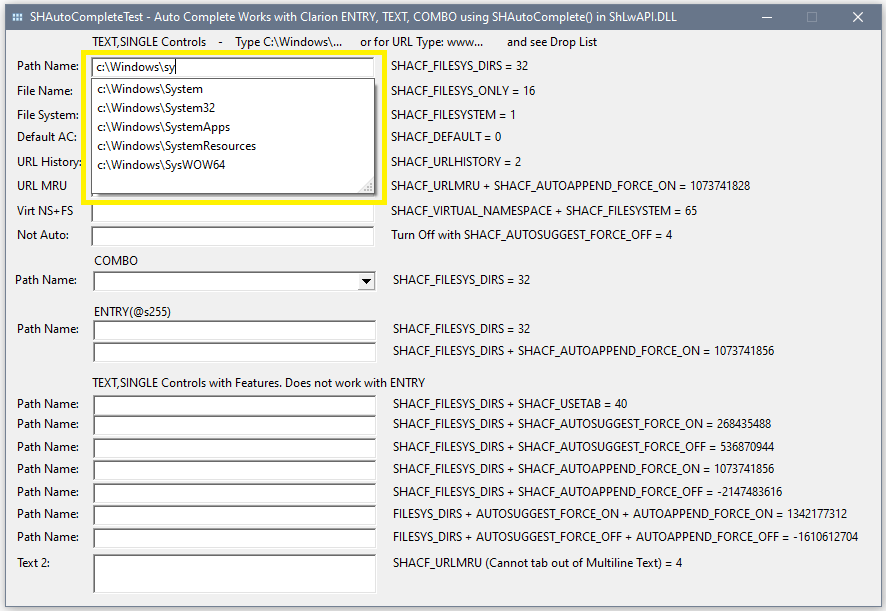
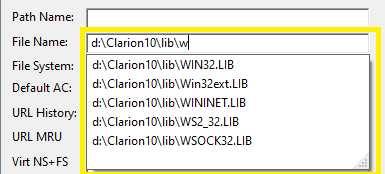

# AutoCompleteFileOrURL

Add an Auto Complete drop list for File, Path or URL with one Windows Shell API call to SHAutoComplete().
 There is an example of calling the SPI directly and also a Class to make it easy to add to a Form ENTRY, COMBO or TEXT,SINGLE.
 
The example lets you try out all the flags. The below screen capture shows the drop list limited to only Paths. 
  


The above Path and below File list only required one code statement: 
```Clarion
  SHAutoComplete(?PathName{PROP:Handle}, SHACF_FILESYS_DIRS)  ! EQUATE(00000020h) Dirs only
  SHAutoComplete(?FileName{PROP:Handle}, SHACF_FILESYS_ONLY)  ! EQUATE(00000010h) Dirs and Files
```


